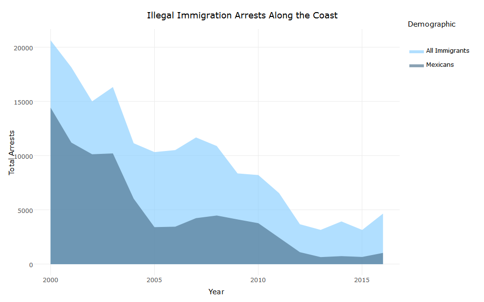
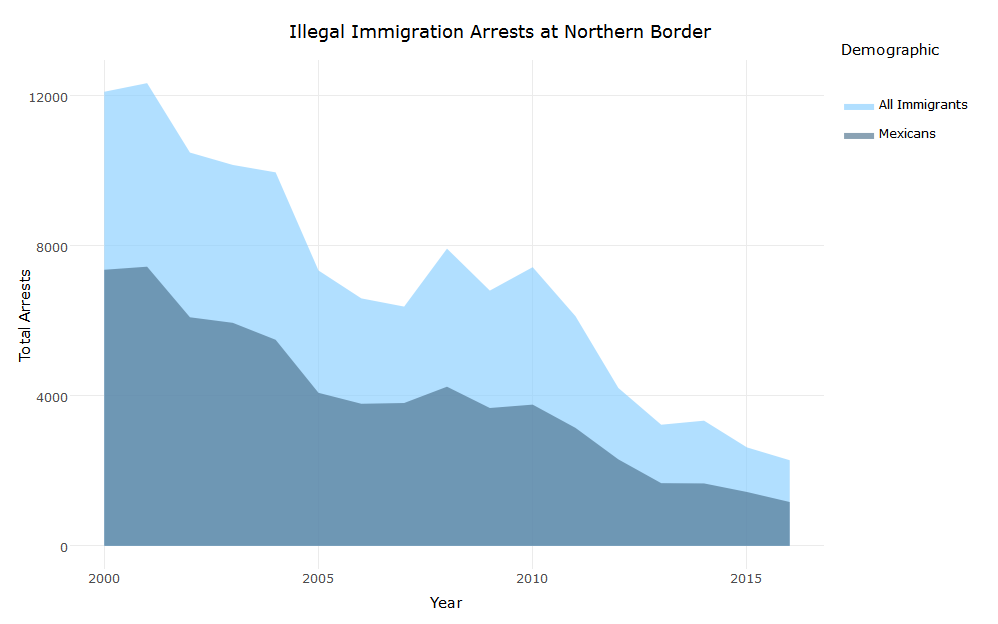
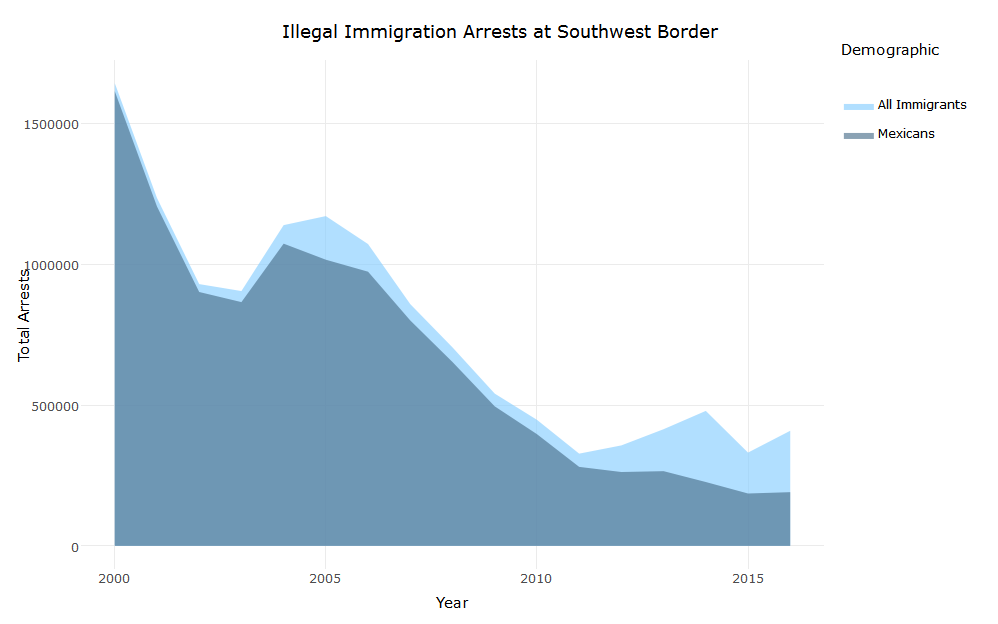
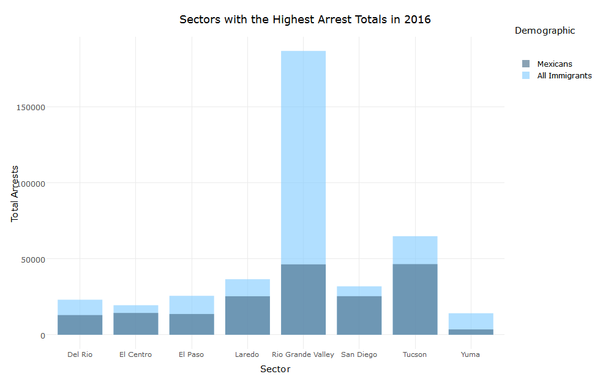
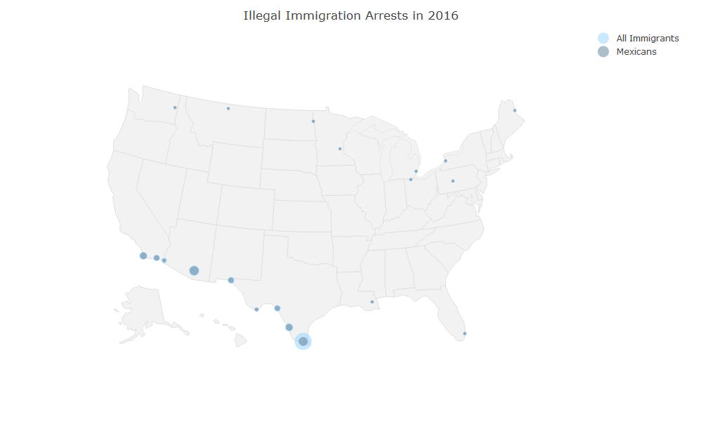

# U.S. Illegal Immigration Arrests from 2000-2016
## Data Visualization Using R

## Abstract
The goal of this project is to explore trends in US illegal immigration arrests from 2000-2016 as objectively as possible.  The data set used can be found on [Kaggle](https://www.kaggle.com/cbp/illegal-immigrants).
The information contained in the original data set was messy so the main
focus of my project was to clean the data and create visualizations of the arrest trends for the two demographics it contained information on:
Mexicans and All Illegal Immigrants.  Also for anyone who is interested
I have uploaded another version of the project using R Markdown and Shiny Apps [here](https://bryandaetz.shinyapps.io/Illegal_Immigration/) that has more interactive graphs.


## Loading Packages
```
library(tidyr)    #tidyr and stringr used for cleaning data
library(stringr)
library(plyr)     #plyr and dplyr used for aggregating data
library(dplyr)
library(ggplot2)  #ggplot2 and plotly used for data visualition
library(plotly)
library(ggmap)   #ggmap used for geocode function to get latitude and longitude info for cities
```

## Cleaning the Data
The original data set needs to be cleaned before any useful visualizations can be created.  Most of the cleaning was done using the `tidyr` and `stringr` packages.

```
#Importing Illegal Immigration data set from Kaggle
arrests <- read.csv("arrests.csv")

#attempting to clean the untidy dataframe
arrests <- gather(arrests, Description, Number_Arrested, -Border, -Sector, -State.Territory)
arrests <- separate(arrests, Description, c("Year", "Demographic"))

#removing the X's from the Year column
arrests$Year <- gsub(pattern = "X", replacement = "", x = arrests$Year)

#the Year column is currently a character vector and we need it to be a numerical vector to be able to create
#meaningful graphs
arrests$Year <- as.integer(arrests$Year)

#changing "All" in the Demographic column to "All Immigrants" to make it more clear
arrests$Demographic <- str_replace(arrests$Demographic, "All", "All Immigrants")
```


For anyone who is interested in exploring the data without having to clean the data themselves, I have uploaded the clean data set [here](https://github.com/bryandaetz/US_Illegal_Immigration_Arrests/blob/master/immigration_arrests.csv) on my GitHub page.


## Overview of Yearly Arrest Totals

First, I want to take a look at the yearly illegal immigration arrest totals in the United States for both demographics: Mexicans and All Immigrants.  I used the `dplyr` package to aggregate the data and the 
`ggplot2` and `plotly` packages to create interactive visualizations.  

```
#creating a new dataframe with yearly arrest totals
#it appears the original dataframe already included totals as observations where Border == United States

totals <- arrests %>%
              group_by(Year, Demographic) %>%
              filter(Border == "United States") %>%
              arrange(Demographic)

#creating an area plot comparing yearly arrest totals of all immigrants and of only mexican immigrants 

tot <- ggplot(totals, aes(x = Year, y = Number_Arrested, fill = Demographic)) +
          geom_area(alpha = 0.65, position = "dodge") +
          scale_fill_manual(values = c("skyblue1", "skyblue4")) +
          xlab("Year") +
          ylab("Total Arrests") +
          ggtitle("Total Illegal Immigration Arrests") +
          theme_minimal()
ggplotly(tot)
```
<iframe width="900" height="800" frameborder="0" scrolling="no" src="//plot.ly/~bryandaetz/8.embed"></iframe>

Looking at the graph, it is clear the overall trend in arrests is decreasing.  The arrest totals in 2016 are significantly lower than they were in 2000, and aside from a spike in 2004 and 2005, they have been decreasing fairly consistently every year. Additionally, it appears that the percentage of these arrests accounted for by Mexican immigrants has been decreasing as well. 

To get a better understanding of the exact percentage each year I'm going to create a table that shows the yearly arrest totals for both demographics as well as the percentage of arrests accounted for by Mexicans.

```
#creating separate dataframes with just "Mexicans" arrests and just "All Immigrants" arrests to find the percentage
# of arrests accounted for by Mexican immigrants each year

mexican_arrests <-  filter(arrests, Border == "United States", Demographic == "Mexicans")
all_arrests <- filter(arrests, Border == "United States", Demographic == "All Immigrants")

#creating a new dataframe with these percentages (rounded to 2 decimal places) as well as the number of Mexican
# immigrants arrested and the total number of arrests for each year

percentages <- data.frame(all_arrests$Year, 
                          mexican_arrests$Number_Arrested,
                          all_arrests$Number_Arrested,
                          round(mexican_arrests$Number_Arrested / all_arrests$Number_Arrested * 100, digits = 2))
names(percentages) <- c("Year","Mexicans_Arrested", "Total_Arrests", "Percentage")

percentages
```


| Year | Mexicans Arrested   | Total Arrests   | Percentage |
|------|---------------------|-----------------|------------|
| 2000 |         1,636,883   |    1,676,438    |   97.64    |
| 2001 |         1,224,047   |    1,266,214    |   96.67    |
| 2002 |           917,993   |      955,310    |   96.09    |
| 2003 |           882,012   |      931,557    |   94.68    |
| 2004 |          1,085,006  |     1,160,395   |   93.50    |
| 2005 |          1,023,905  |     1,189,075   |   86.11    |
| 2006 |           981,066   |     1,089,092   |   90.08    |
| 2007 |           808,688   |      876,704    |   92.24    |
| 2008 |           661,766   |      723,825    |   91.43    |
| 2009 |           503,386   |      556,041    |   90.53    |
| 2010 |           404,365   |      463,382    |   87.26    |
| 2011 |           286,154   |      340,252    |   84.10    |
| 2012 |           265,755   |      364,768    |   72.86    |
| 2013 |           267,734   |      420,789    |   63.63    |
| 2014 |           229,178   |      486,651    |   47.09    |
| 2015 |           188,122   |      337,117    |   55.80    |
| 2016 |           192,969   |      415,816    |   46.41    |

## Arrests at Each Border

Next, I would like to take a look at the yearly arrest totals at each of the three borders in the data set: Coast, North and Southwest. To avoid rewriting the same code multiple times for each border I've chosen to instead write function that will allow me to input a given border and output a graph of the yearly arrest totals for that border.

```

#creating a new dataframe with yearly arrest totals by border
#again the original dataframe already included this totals as observations where Sector == All

by_border <- arrests %>%
                  group_by(Year, Demographic) %>%
                  filter(Sector == "All") %>%
                  arrange(Demographic)

#Writing a function that will create a graph for a given border

border <- function(x, label) {
t <- ggplot(filter(by_border, Border == x), 
                aes(x = Year, y = Number_Arrested, fill = Demographic)) +
              geom_area(alpha = 0.65, position = "dodge") +
              scale_fill_manual(values = c("skyblue1", "skyblue4")) +
              xlab("Year") +
              ylab("Total Arrests") +
              ggtitle(label) +
              theme_minimal()
ggplotly(t)
}

border("Coast", "Illegal Immigration Arrests Along the Coast")
border("North", "Illegal Immigration Arrests at Northern Border")
border("Southwest", "Illegal Immigration Arrests at Southwest Border")

```




The majority of arrests have clearly occured along the Southwest Border.
Additionally, the percentage of arrests accounted for by Mexican immigrants is clearly lower for the Coast and North borders than it is for the Southwest border.  This is unsurprising considering that this is the United States/Mexican border.  It is surpising, however, to see that there were still a decent amount of Mexican immigrants that were arrested along the United States/Canadian border (North).  The data set didn't specify the nature of any of the arrests so I can only speculate about how this could have occured. It is possible that these people had illegally immigrated from Mexico earlier and were living in the northern United States when they were later arrested by the border patrol there, but it is impossible to confirm this theory with the data I have currently.

## Sectors with the Most Arrests

The last element of the data set that I'd like to explore is the sectors with the most arrests each year.  The original data set was somewhat unclear on what they meant by the word sector.  The sectors listed are all cities in the United States, but it isn't clear whether they are intended to be just the cities, the surrounding counties, or some other area around the cities.

In any case, the first step is to create bar plots showing the sectors with the most arrests each year.  In earlier iterations of the project, I considered using a facet wrap to show the plots for each year side by side, but since the data spans 17 years, this approach proved to be too cluttered and difficult to read.  I also considered having the bar plots show the arrest totals for all 21 sectors, but again this made them extremely cluttered.  My solution was to write a function that finds the sectors with the 8 highest arrest totals for a given year and displays them on a bar plot.

``` 
#creating a function to show a bar graph of the 8 sectors with the highest arrest totals for a given year

yearPlot <- function(yr, title = paste("Sectors with the Highest Arrest Totals in", as.character(yr))) {
    temp <- filter(arrests, Sector != "", Sector != "All", Year == yr) #filtering out rows that don't apply to
                                                                        # to a specific Sector
                                                                        #filtering by the provided Year value
    
    top8 <- temp %>%
              filter(Demographic == "All Immigrants") %>% 
      #finding the Sectors with the 8 highest arrest totals for that year
              arrange(desc(Number_Arrested))            
    top8 <- top8[1:8,]
    
    temp <- filter(temp, Sector %in% top8$Sector)  #filtering by the Sectors w/ the 8 highest arrest totals
    temp$Demographic <- ordered(temp$Demographic, levels = c("Mexicans", "All Immigrants"))
                                                              #setting the level order for the Demographic
                                                              # attribute so the smaller values on the bar plot
                                                              # aren't hidden
    
    
    #creating a bar plot comparing the arrest totals for all illegal immigrants and for only mexican immigrants

    plot <- ggplot(temp, aes(x = Sector, y = Number_Arrested, fill = Demographic)) +
                geom_bar(stat = "identity", position = "identity", alpha = .65) +
                scale_fill_manual(values = c("skyblue4", "skyblue1")) +
                xlab("Sector") +
                ylab("Total Arrests") +
                ggtitle(title) +
                theme_minimal() +
                theme(axis.text.x = element_text(size = 8))
    ggplotly(plot)    #making the plot interactive
}    
```

Since the bar plots will only show the arrest totals for 8 of the 21 sectors each year, I would also like to plot all the sectors on a US map.  The map will be interactive and will display the arrest totals for Mexicans and All Immigrants when you hover over a sector.  Unfortunately, this requires latitude and longitude information for the sectors, which the original data set did not include.  Luckily, the 
`ggmap` package includes a `geocode` function that can get this information for me.  However, this function takes a while to run and there is a limit to how many API calls you can do per day, so I decided to create a separate csv file of the data set with the latitude and longitude information to avoid running it more than once.  That file is also available [here](https://github.com/bryandaetz/US_Illegal_Immigration_Arrests/blob/master/arrestLocations.csv) on my github page for those who are interested.

```
#creating a vector with all the different sectors
Sector <- levels(arrests$Sector)

#taking out the sectors "All" and "" which are used for totals and aren't actual individual sectors
Sector <- Sector[3:length(Sector)]

#using the geocode command to get the latitude and longitude for each sector
locations <- data.frame(Sector, geocode(Sector, output = "latlon"))

#subset of arrests dataframe with only the rows for individual sectors, no totals
arrests2 <- filter(arrests, Sector != "", Sector != "All")

#merging the arrests2 and locations dataframes to get the latitude and longitude information for each Sector
arrests_loc <- join(x = arrests2, y = locations,
                    by = "Sector", type = "left")
write.csv(arrests_loc, file = "arrestLocations.csv")
```

```
#importing csv file with locations to avoid having to run the geocode command more than once
arrests_loc <- read.csv("arrestLocations.csv")
```

I found the code that I am using to import a blank U.S. map on the 
`plotly` documentation [website](https://plot.ly/r/scatter-plots-on-maps/).  After importing the map, the next step is to write a function, similar to what I did for the bar plots, that will plot all the sectors (with information on the arrest totals) on the map for a given year.

```
# getting a map of the United States to show the areas with the most arrests
# this was the example US map from the plotly documentation page

g <- list(
  scope = "usa",
  projection = list(type = "albers usa"),
  showland = TRUE,
  landcolor = toRGB("gray95"),
  subunitcolor = toRGB("gray85"),
  countrycolor = toRGB("gray85"),
  countrywidth = 0.5,
  subunitwidth = 0.5
)

#creating a function to create a map of the areas with the most arrests for a given year

mapPlot <- function(yr) {
        tmp <- filter(arrests_loc, Year == yr)
        p <- plot_geo(tmp, lat = ~lat, lon = ~lon, 
                      color = ~Demographic, 
                      colors = c("skyblue1", "skyblue4"), 
                      size = ~Number_Arrested,
                      sizes = c(10, 300),
                      alpha = 0.65,
                      text = ~paste('Demographic: ', Demographic, 
                        '</br> Sector: ', Sector,
                        '</br> Arrests: ', Number_Arrested)) %>%
          add_markers() %>%
          layout(geo = g)
        print(p)
}
```
In the version of this projected that I uploaded to the Shiny App website using R Markdown and Shiny Apps, I created a dropdown menu where you can select any year from 2000-2016 and view the bar plot and U.S. showing the sectors with the highest arrest totals for that year.  If anyone is interested in seeing that it can be found [here](https://bryandaetz.shinyapps.io/Illegal_Immigration/).

Here I am just going to show the visualizations for 2016.

```
barPlot(2016)
mapPlot(2016)
```



The circles on the U.S. map scale to the number of arrests in that sector (i.e. bigger circle = more arrests).  In 2016, Rio Grande Valley, Texas had the most arrests by far, although interestingly only a small portion of the arrests were accounted for by Mexican immigrants. It would be interesting to see what other countries the illegal immigrants that were arrested there came from, but unfortunately the data set did not contain that information.

## Final Thoughts

While the data set did have its limitations, it is undeniable that the number of U.S. illegal immigration arrests has been decreasing over the past 17 years. I was able to create some useful visualizatons comparing the number of arrests for the two demographics that I had data for.  Unfortunately, the All Illegal Immigrants demographic was rather vague. I was able to conclude that the percentage of border patrols arrests accounted for by Mexicans has decreased significantly, but it is unclear what other countries the immigrants that were arrested originated from.


